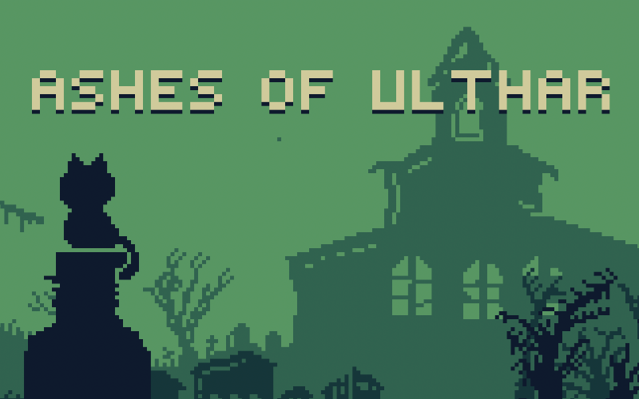

# js13k-2025-ashes-of-ulthar

> My 2025 entry for the js13kgames competition, Ashes of Ulthar.

## PLAY THE GAME!

 - Play the version submitted to game jam at: https://js13kgames.com/2025/games/ashes-of-ulthar
 - The "Director's Cut" (most recent version) is available at: https://ashes-of-ulthar.7tonshark.com

## INSTRUCTIONS

Unguided and seeking, you find yourself drawn to the village of Ulthar. Your sudden presence is a reminder of the incident with their cats decades ago, but your influence soon drowns out the villagers' alarm. As otherworldly ashes fall from the sky, you begin preparations.

Play with your keyboard and race against the clock in this eerie pixel-art resource simulation game.

 - Village sanity is slowly draining; free the village before sanity runs out.
 - Recruit villagers and assign jobs to collect and manage resources.
 - Use the Codex to unlock jobs, abilities, and upgrades.
 - Start the ritual and free the village.

## CHANGELOG

See the [releases page](https://github.com/elliot-nelson/js13k-2025-ashes-of-ulthar/releases) for change and version information.
